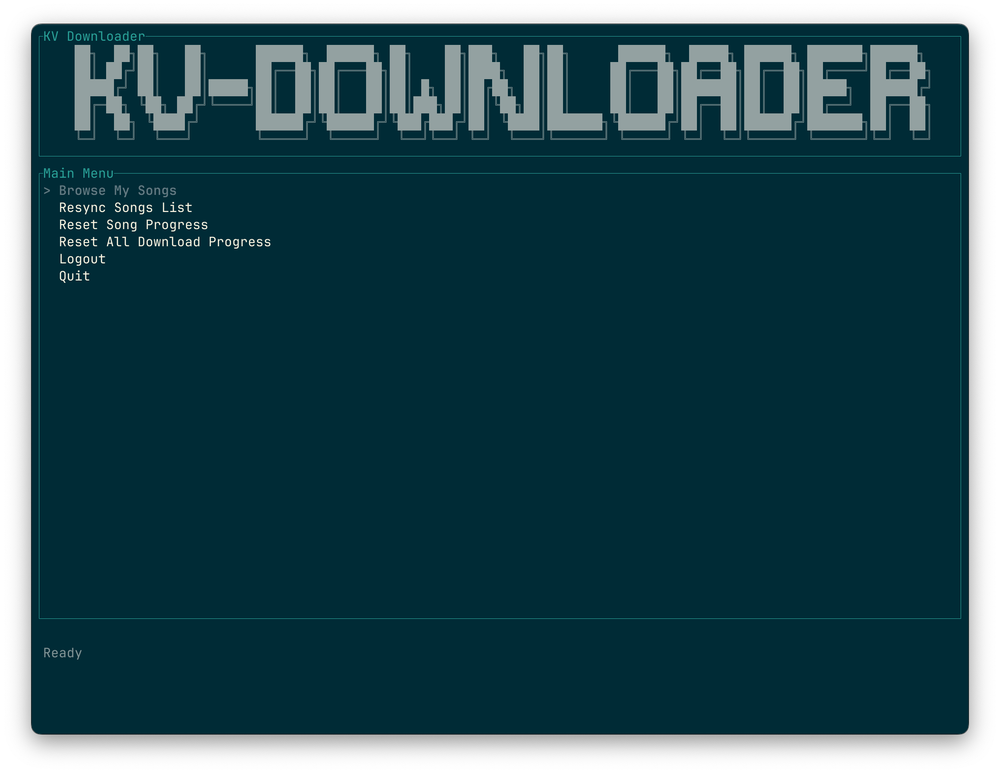
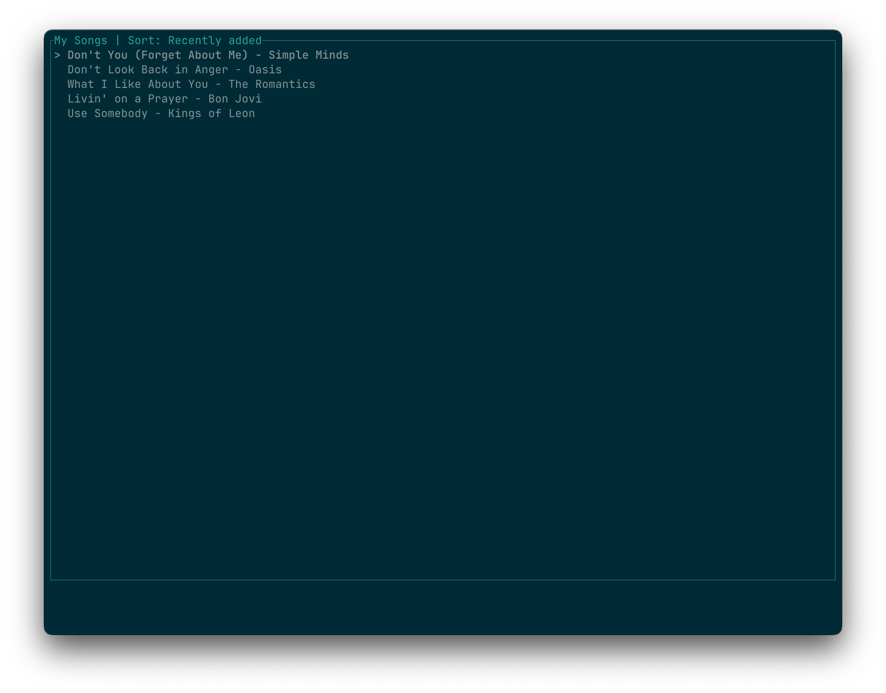
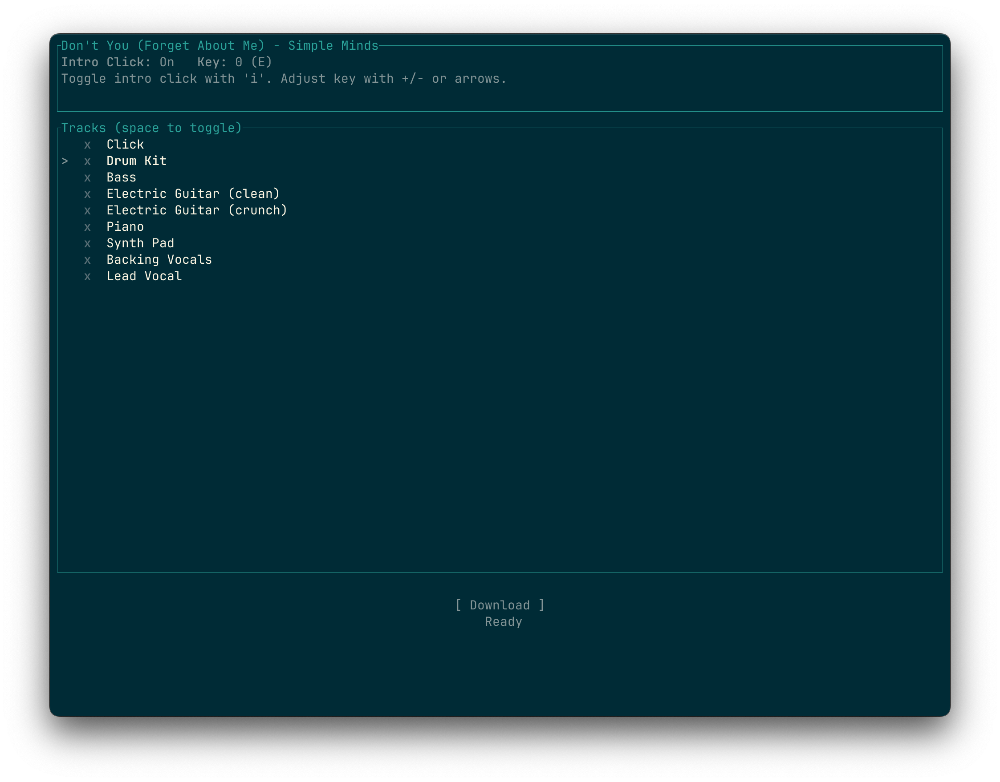
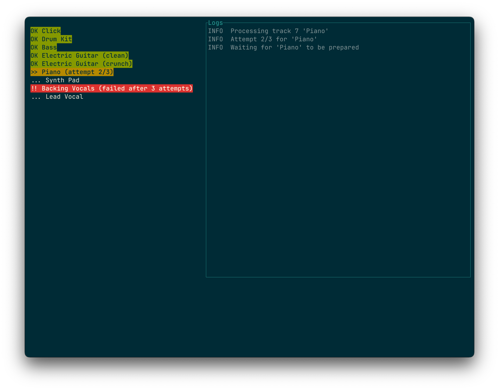
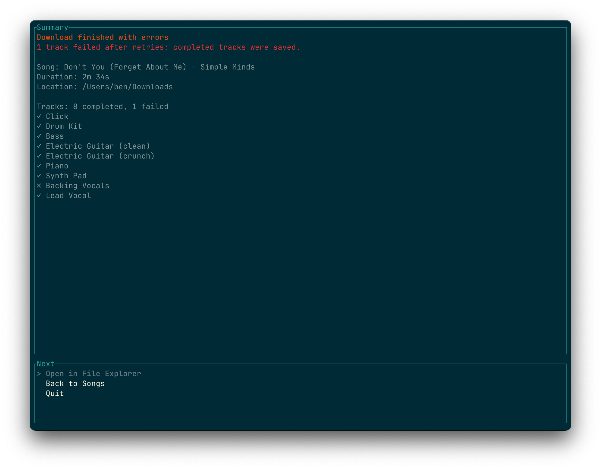

# kv-downloader

```text
██╗  ██╗██╗   ██╗      ██████╗  ██████╗ ██╗    ██╗███╗   ██╗██╗      ██████╗  █████╗ ██████╗ ███████╗██████╗
██║ ██╔╝██║   ██║      ██╔══██╗██╔═══██╗██║    ██║████╗  ██║██║     ██╔═══██╗██╔══██╗██╔══██╗██╔════╝██╔══██╗
█████╔╝ ██║   ██║█████╗██║  ██║██║   ██║██║ █╗ ██║██╔██╗ ██║██║     ██║   ██║███████║██║  ██║█████╗  ██████╔╝
██╔═██╗ ╚██╗ ██╔╝╚════╝██║  ██║██║   ██║██║███╗██║██║╚██╗██║██║     ██║   ██║██╔══██║██║  ██║██╔══╝  ██╔══██╗
██║  ██╗ ╚████╔╝       ██████╔╝╚██████╔╝╚███╔███╔╝██║ ╚████║███████╗╚██████╔╝██║  ██║██████╔╝███████╗██║  ██║
╚═╝  ╚═╝  ╚═══╝        ╚═════╝  ╚═════╝  ╚══╝╚══╝ ╚═╝  ╚═══╝╚══════╝ ╚═════╝ ╚═╝  ╚═╝ ╚══════╝╚═╝  ╚═╝
```

[](https://github.com/subdigital/kv-downloader/actions/workflows/ci.yml)

`kv-downloader` automates downloading the individual tracks from songs purchased through [Karaoke Version](https://www.karaoke-version.com/). It is intended for building your own backing-track mix in software such as Logic Pro.

> [!IMPORTANT]
> This workflow is specific to how I use Karaoke Version. You are welcome to fork the project. Pull requests may be accepted when the changes are useful and general enough.

## kv-downloader or kvui?

The repository includes two applications backed by the same download engine:

| | `kv-downloader` | `kvui` |
|---|---|---|
| Interface | Command-line commands and options | Interactive terminal UI |
| Best for | Scripts, automation, and downloading a known song URL | Browsing your purchased library and managing downloads |
| Selecting a song | Paste its Karaoke Version URL | Search and select it from a locally cached catalog |
| Selecting tracks | Downloads through CLI options/workflow | Toggle individual tracks interactively |
| Progress | Console logs | Live per-track status, retries, failures, and completion summary |
| Resume support | Yes | Yes, with controls to reset one song or all progress |
| Installed executable | `kv_downloader` | `kvui` |

Use **`kv-downloader`** when you already have a song URL or want a scriptable command. Use **`kvui`** when you want to browse and search your account, choose tracks visually, and monitor a multi-track download.

> [!NOTE]
> `kvui` is an early experiment in building a terminal UI for this workflow. Its interface, local catalog format, controls, and behavior may change, and it may be less reliable than the established `kv-downloader` command-line workflow. Feedback and bug reports are welcome.

## Requirements

- macOS, Linux, or Windows
- A Karaoke Version account with purchased songs
- Chromium, used for authentication and as a visible fallback when the website presents a browser challenge

## Installation

### Download a release

1. Open the repository's **Releases** page.
2. Download the archive for your platform.
3. Extract `kv_downloader`, `kvui`, or both.
4. Move the executables to a directory in your `PATH`.

For example, on macOS or Linux:

```bash
chmod +x kv_downloader kvui
mv kv_downloader kvui ~/.local/bin/
```

Ensure `~/.local/bin` is in your `PATH`, or choose another bin directory such as `/usr/local/bin`.

> [!IMPORTANT]
> macOS Gatekeeper may block a downloaded executable the first time it runs. Open **System Settings → Privacy & Security** and choose **Open Anyway** for the blocked application.

### Install from source

Install both applications with Cargo:

```bash
git clone https://github.com/subdigital/kv-downloader.git
cd kv-downloader
cargo install --path cli
cargo install --path kvui
```

Or build local release binaries:

```bash
cargo build --release -p cli -p kvui
```

The binaries will be written to `target/release/kv_downloader` and `target/release/kvui`.

## Authentication

You can authenticate from either interface:

```bash
kv_downloader auth
```

or launch `kvui` and select **Login**.

Credentials are stored using your operating system's secure credential store. They are sent only to Karaoke Version. Both applications share the same stored authentication.

For development, a `.env` file may instead provide:

```dotenv
KV_USERNAME=your_username
KV_PASSWORD=your_password
```

Log out with `kv_downloader logout` or the **Logout** action in `kvui`. Logging out of `kvui` also clears its local song catalog and saved download progress.

## kvui terminal interface

Launch the terminal UI with:

```bash
kvui
```

From a source checkout:

```bash
cargo run -p kvui
```

<p align="center">
  
</p>

### Browsing and selecting tracks

The purchased-song catalog can be searched and sorted locally. After selecting a song, choose exactly which tracks to download, whether to include the intro count, and how far to transpose the song.

<p align="center">
  
  
</p>

Useful song-list controls:

- `/` — enter a title or artist filter
- `s` — cycle between recently added, artist, and title sorting
- Arrow keys — move through songs
- `Enter` — open the selected song

On the track screen, use `Space` to toggle a track, `i` to toggle the intro count, and `+`/`-` or Left/Right to transpose.

Choose **Set Download Folder** from the main menu to enter an existing folder. `~` and relative paths are supported. `kvui` saves the selection in the platform-specific configuration directory and restores it the next time it launches; until changed, downloads go to `~/Downloads`.

### Download status and completion

`kvui` displays each track's state, the current retry attempt, live diagnostic logs, and a final summary. Completed tracks remain available even when another track fails.

<p align="center">
  
  
</p>

## How kvui works

### Song catalog synchronization

- The first browse synchronizes every page of purchased songs in date-descending order.
- Songs are stored in a local SQLite catalog in the platform-specific application-data directory.
- Later visits display cached songs immediately and perform an incremental refresh in the background.
- Incremental synchronization stops when it reaches a song already present in the catalog.
- **Resync Songs List** performs a complete, all-pages refresh.
- If synchronization fails partway through, the existing catalog remains available.
- Search and sorting happen locally, so they are immediate and independent of Karaoke Version's current server ordering.

### Downloads, retries, and resume

1. `kvui` fetches the selected song's available tracks and original key.
2. You select the tracks, intro count setting, and transposition.
3. Each selected track is built and downloaded separately through the direct HTTP workflow.
4. A failed track is retried up to three times, with a delay between attempts. Exhausted failures do not prevent the remaining tracks from downloading.
5. Progress is saved after successful tracks. Running the same song and mix options again skips those files and resumes the unfinished work.
6. Progress is keyed by song URL, intro count, and transposition, preventing one mix variant from being mistaken for another.

The TUI includes actions to reset progress for a selected song or delete all saved progress. It also detects suspicious byte-identical responses within a run and retries them rather than silently accepting a stale mix.

### Browser challenge fallback

Normal downloads use direct HTTP requests. If Fastly or Cloudflare returns a browser-verification challenge, `kvui` can open a visible Chromium session to complete the request. The browser uses settings that avoid repeated macOS Keychain prompts.

### Diagnostics

The on-screen log follows new messages automatically. Up/Down pauses following, and End resumes it. To save detailed diagnostics to the default `kvui-diagnostics.log` file, run:

```bash
kvui --diagnostics
```

Choose another path with:

```bash
kvui --diagnostics /path/to/kvui.log
```

Diagnostic output is filtered to this application and redacts cookie values.

## kv-downloader command-line usage

First purchase the song through Karaoke Version and copy its URL. Then run:

```bash
kv_downloader download <song-url>
```

Common download options:

- `-d <path>` — change the download location
- `-t <offset>` — transpose by semitones; for example, `-1` lowers the key by a half step
- `--count-in` — include the intro precount on all tracks
- `--browser` — use Chromium automation instead of the default HTTP downloader
- `--headless` — run Chromium headlessly when `--browser` is enabled
- `--debug` — enable detailed logging

Example:

```bash
kv_downloader download <song-url> -d my_song_dir --count-in -t -1
```

For source checkouts, place `-p cli` before Cargo's `--` separator:

```bash
cargo run -p cli -- download <song-url> -d my_song_dir --count-in
```

Headless mode can make browser behavior less obvious, so test the visible browser mode first when diagnosing a problem.

## Screenshot automation

The documentation screenshots use deterministic demo data and do not access an account. On macOS, with WezTerm and ImageMagick installed, regenerate them with:

```bash
./scripts/capture-tui-screenshots.sh
```

macOS must grant Screen Recording and Accessibility permission to the terminal running the script.

## Use at your own risk

This tool automates a process that you would otherwise perform manually. Avoid huge or concurrent batches; abusive automation may violate Karaoke Version's terms or put your account at risk.

And Karaoke Version, if you're listening: we'd love for this workflow to be officially supported in the UI.

## License

This source code is released under the MIT license.
